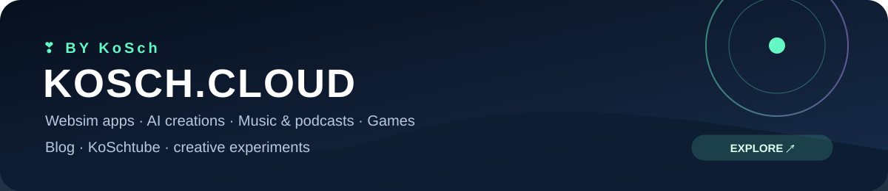

  <a href="PRIVACY.md"><strong>🔐 Datenschutz / Privacy</strong></a> · <a href="PRIVACY-SOURCES.md"><strong>All sources & providers</strong></a> · <a href="https://kosch.cloud"><strong>Impressum / kosch.cloud</strong></a> · <a href="ANDROID-ARCHIVE.md"><strong>APK archive</strong></a>

  

  <strong>AI-only intelligence for models, agents, research, infrastructure, robotics, safety and governance.</strong> 
  Source-first · 160 registered AI sources · 61 provider monitors · refreshed every 30 minutes

  
  

> [!WARNING]
> **BETA / IN DEVELOPMENT.** AI News and the Android APK are active test builds and may contain bugs, incomplete functions, inaccurate classifications, notification issues or breaking changes. **Use at your own risk / Nutzung auf eigene Gefahr.** Do not rely on the app as the sole source for important, legal, safety-critical, financial or operational decisions. Verify important information with the linked original sources. The directly distributed APK is currently a **debug-signed beta build**, not a production Play Store release.

  <a href="https://github.com/chekento/Ainews/releases/download/android-latest/AI-News.apk"><strong>⬇ CURRENT APK — ANDROID 3.7.3 BETA</strong></a> 
  <a href="https://github.com/chekento/Ainews/releases/tag/android-latest">Release details</a> ·
  <a href="https://github.com/chekento/Ainews/releases/download/android-latest/AI-News.apk.sha256">SHA-256 checksum</a> ·
  <a href="PRIVACY.md">Datenschutz / Privacy & all sources</a> ·
  <a href="https://kosch.cloud">Impressum / kosch.cloud</a>

  
  
  

  
  

---

<table>
<tr>
<td width="50%" valign="top">

### ◈ LIVE INTELLIGENCE

Strict AI-only relevance filtering across labs, research, independent reporting, governance and safety sources.

**[Open current news →](portal/news.md)**

</td>
<td width="50%" valign="top">

### 📱 ANDROID 3.7 BETA

Command Center home, Discover search, source controls, saved stories, Copilot, Smart Watches and nine configurable home-screen widgets.

**3.7.3 UX layer:** Readability recovery, one primary navigation surface, Matrix-safe scrolling, duplicate-WebView boot prevention, an explicit Settings entry and a dedicated Discover surface are included in this repair build.

**3.7 UX layer:** Official X/Twitter, LinkedIn, YouTube, Instagram and Facebook provider profiles; collapsible Copilot; API-free local topic discussion; live news/social radar with adjustable window; Matrix glyph rain; 28 selectable app/widget themes and two Kawaii plush themes.

**[⬇ Download current APK →](https://github.com/chekento/Ainews/releases/download/android-latest/AI-News.apk)**

</td>
</tr>
<tr>
<td width="50%" valign="top">

### 🖼️ VISUAL NEWS CARDS

Publisher images are embedded only when explicitly supplied in RSS/Atom metadata. Otherwise the UI uses bundled fallback visuals. No article-page image scraping.

</td>
<td width="50%" valign="top">

### ⌕ POWER SEARCH

Search supports `source:`, `provider:`, `cat:`, `tag:`, `type:`, `after:`, `before:`, `is:saved`, `is:primary`, quoted phrases and negative terms.

**[Provider wire →](portal/llm-wire.md)**

</td>
</tr>
</table>

---

<!-- LATEST_AI_NEWS:START -->
## 🔴 Live AI Intelligence

**160 registered sources · 61 provider monitors · AI-only filter v4 · snapshot 2026-09-20 18:19 UTC**

| # | Source | Desk | Media | AI relevance | Headline |
|---:|---|---|:---:|---|---|
| 01 | **Anthropic News** | Industry | ◈ | ● HIGH | [Measurements for understanding the pace of AI development inside frontier labs - Anthropic](https://news.google.com/rss/articles/CBMid0FVX3lxTE1hSlNaZU5CMXdjOERiMTltcEVxMXduUXVrT1UtSExlUGlUUHFCc2huOVM0NEY0cmhCMVF6X0o2QjMwUUZOQkhuSGlHVjFlaWdKelR3ZTEzUV9SRzRIdkxhV3RfQ0N2OUI5U214a0RqZjh3c2MxUktr?oc=5) |
| 02 | **TechCrunch AI** | Industry | ◈ | ● HIGH | [ScrollEd wants to turn textbooks into TikTok](https://techcrunch.com/2026/09/20/scrolled-wants-to-turn-textbooks-into-tiktok/) |
| 03 | **Reddit · r/MachineLearning** | Research | ◈ | ● HIGH | [How is your experience with ICLR LLM Feedback? [D]](https://www.reddit.com/r/MachineLearning/comments/1wllbz0/how_is_your_experience_with_iclr_llm_feedback_d/) |
| 04 | **Reddit · r/MachineLearning** | Industry | ◈ | ● HIGH | [Zero-shot Neural Style Transfer (NST) App [P]](https://www.reddit.com/r/MachineLearning/comments/1wll52g/zeroshot_neural_style_transfer_nst_app_p/) |
| 05 | **The Decoder** | Compliance & Ethics | 🖼️ | ● HIGH | [Alibaba's open-weight Qwen-Image-2.1 claims to beat closed models in image generation with just 7 billion parameters](https://the-decoder.com/alibabas-open-weight-qwen-image-2-1-claims-to-beat-closed-models-in-image-generation-with-just-7-billion-parameters/) |
| 06 | **The Verge AI** | Compliance & Ethics | 🖼️ | ● HIGH | [Trump now says he wants to form an ‘AI Force’](https://www.theverge.com/ai-artificial-intelligence/997867/trump-ai-force-ai-czar) |
| 07 | **Cursor Blog** | Industry | ◈ | ● HIGH | [Usage Dashboard - Cursor - Cursor](https://news.google.com/rss/articles/CBMiSkFVX3lxTFA1d2R6RlhlT0NrNmlHMUkwSVltYzVJMm5CUzRPOEZHSGdPbzJxNzFBOWlPZGVaekVvVFBkZ3VVa0pyRmRtWUdKTnlB?oc=5) |
| 08 | **Luma AI** | Industry | ◈ | ● HIGH | [- app.lumalabs.ai](https://news.google.com/rss/articles/CBMiRkFVX3lxTE1RemJaNHljYXZ1ZC04dC1PUVVqVkhLSDZsMUQ0TjB2WG8xWkdwZTFUcE5jX0JTLWNhTDlXSVlzZDY1UHNQTHc?oc=5) |
| 09 | **Cursor Blog** | Industry | ◈ | ● HIGH | [Billing - Cursor - Cursor](https://news.google.com/rss/articles/CBMiTEFVX3lxTE5nV25Pa3V2bElCcXUwYzEwSlpmc0picHR5YlRKM0xoZnNhZXliY19hVWNvVms0X29kLWdSaHJ1YjhTYlZMcHdybXMyUGY?oc=5) |
| 10 | **Reddit · r/MachineLearning** | Industry | ◈ | ● HIGH | [Autograd project [P]](https://www.reddit.com/r/MachineLearning/comments/1wlj8vv/autograd_project_p/) |
| 11 | **Product Wire · Google Antigravity** | Products & Agents | ◈ | ● HIGH | [Google Antigravity vs Kiro vs Windsurf: $200 Gap [2026]](https://news.google.com/rss/articles/CBMib0FVX3lxTE9wOGVPWXUwVFgxS2dLbUtxTlByQ3JKN2VJcFQ5RTlPZnlyZWgtaHBwX0hvQUtBYmJ0X0NOWUwtRGJvOXBYTE1scHB4OXo5NW1tcHVvSDRGeGZBT2ZQZzNBbDkyNHNUN3JqUU9YQ1RJWQ?oc=5) |
| 12 | **Vocal · provider monitor** | Industry | ◈ | ● HIGH | [I Spent a Week With the Doubao AI Phone. Here’s the Truth About Whether It’s Worth $800.](https://news.google.com/rss/articles/CBMiqgFBVV95cUxOZzZjNW1FbXIybGR5UTNIMVdEVVZXalRvaVczbFB0N2lWQUZCN3R4d1R1RkQ3N2V6WW0xZ3dmMlZ0Nm5UdTU5LTIzS0JDOXd6dUVSczU3VjhSc3NHR0hRdmhuYndsNkRPakdDcDBTQndQVTdKTVpFOFhJNUw3QUoyQk00NzlsdUJVcm4zY1pleFZ6RWRHRHdUNFJ0Q19TX1F5aEtlZENHMlNLUQ?oc=5) |

[→ Full generated dataset](data/news.json) · [→ Core sources](config/sources.json) · [→ Extended sources](config/sources-extra.json) · [→ Full transparency catalog](PRIVACY-SOURCES.md)

> **Image policy:** publisher artwork is used only when it is explicitly exposed in RSS/Atom metadata. No article-page image scraping. The Android/Web UI falls back to bundled AI News visuals when no feed image is available.

> **Beta data-quality note:** automated relevance, categorization, provider matching and summaries can still be incomplete or wrong. Verify important information with the linked original source.
<!-- LATEST_AI_NEWS:END -->

---

<!-- PRODUCT_WIRE:START -->
## ◈ Product & Service Wire

The product desk monitors usable AI services separately from general model news: Claude Code, Google Antigravity, Google Flow, Make, Zapier, KNIME, Suno, Udio, Websim.ai and more.

**Tracked:** 114 products · official product pages · original-link news monitoring · no article mirroring.

**[→ Product registry](config/products.json)** · **[→ Android APK archive](ANDROID-ARCHIVE.md)**
<!-- PRODUCT_WIRE:END -->

---

## 🧭 Signal Deck

| Desk | Coverage |
|---|---|
| **Frontier Models** | GPT, Claude, Gemini, Llama, Mistral, DeepSeek, Qwen, Grok, Kimi, GLM and more |
| **Products & Agents** | agentic systems, coding, browser/computer use, MCP, RAG, assistants and automation |
| **Research** | AI2, Stanford HAI, MIT, arXiv, BAIR, Epoch AI, METR and benchmarks |
| **Infrastructure** | NVIDIA, Cerebras, Groq, GPUs, inference, data centers, accelerators and compute |
| **Robotics & Embodied AI** | robot learning, humanoids, physical AI and autonomous systems |
| **Safety & Security** | evaluations, red teaming, misuse, cybersecurity, alignment and AI security institutes |
| **Compliance & Ethics** | EU AI Act, European AI Office, WAICO, NIST, OECD, UNESCO and Council of Europe |

---

<!-- COPILOT_INTELLIGENCE:START -->
## ✦ Copilot Intelligence 3.7 · BETA

Copilot is a **contextual intelligence layer**, not a detached chatbot. It follows the selected story, Discover filters, provider context or the full enabled feed and retrieves a source-diverse evidence set across titles, excerpts, tags, providers, categories, provenance and recency.

**Built in:** local API-free discussion mode · evidence cards · primary-source boost · Summary · Why it matters · Compare · Timeline · Risk & policy · Source check · session-only follow-up context · inline Copilot actions · direct Widget → Copilot story summary.

**On-device mode:** optional downloadable Qwen3 0.6B dynamic INT4 model (~328 MB) via LiteRT-LM. After the one-time download, generative Copilot answers run locally without an API key or cloud endpoint.

> Copilot output is experimental. Source grounding reduces error risk but does not eliminate it; inspect the evidence and original publication for important claims.

**[→ Copilot architecture & privacy](portal/copilot.md)**
<!-- COPILOT_INTELLIGENCE:END -->

---

<!-- INTELLIGENCE_SUITE:START -->
## ◉ Intelligence Suite 3.7 — Discover & Expanded Intelligence · BETA

Android 3.7 keeps **Latest · For You · High Signal · Story Clusters · Brief** and adds a more deliberate Discover experience: opening Discover no longer focuses the search field or opens the keyboard. Search starts only after an explicit tap.

**New in 3.7:** Social Wire with 61 provider ecosystems and official multi-platform links · AI product/service wire for Claude Code, Google Antigravity, Flow, Make, Zapier, KNIME, Suno, Udio, Websim.ai and more · API-free local Copilot discussion · optional downloadable Qwen3 on-device LLM · separate Governance desk for AI czar / AI Force, laws and ethics · interactive radar with Matrix rain · 28 app/widget themes including Kawaii Plush and Kawaii Candy ·  Smart Brief presets for Morning / Evening / Since last visit · quick Smart-Watch templates · Widget Studio presets · direct Widget → Copilot story summary · local For-You reset/control · expanded core+extended source registry · 160 AI sources · 61 provider ecosystems.

> **Development status:** this is an active beta/test build. Bugs, incomplete functions and breaking changes are possible. **Use at your own risk / Nutzung auf eigene Gefahr.**

### [⬇ Download AI News Android 3.7 Beta](https://github.com/chekento/Ainews/releases/download/android-latest/AI-News.apk)
<!-- INTELLIGENCE_SUITE:END -->

---

## ✦ AI News 3.7 · UX Command Center

The current beta turns the app and GitHub Page into a personal AI intelligence workspace:

- **Command Center overview:** Signal Atlas and Provider Matrix summarize the live feed before you open a tab.
- **Collapsible controls:** search stays immediately available while filters, categories, provider chips and source controls can be minimized.
- **Complete provider wire:** core + extended registry with provider dossiers, official newsroom links and current coverage.
- **Personal intelligence:** save reusable filters such as `provider:openai cat:Research`, add local RSS/Atom sources and keep an official social-channel directory on the device/browser.
- **Original-source first:** tapping a story opens the linked publication directly; AI News does not copy article pages or social posts.
- **Two native overview widgets:** Signal Stack shows a multi-story overview, while Live AI Radar shows a rolling 72-hour category/provider overview.

All custom filters, sources, profile links and the downloaded on-device model remain local to the current device/browser. Feed access depends on the publisher's RSS/Atom and CORS policy.

---

## 📱 Android 3.7 Beta — Discover & Expanded Intelligence

The APK uses a local mobile interface rather than depending on GitHub Pages. Android 3.7 adds an optional downloadable Qwen3 0.6B on-device model for private generative Copilot conversations. It downloads the current AI-only JSON feed directly from this repository and keeps a bundled offline fallback inside the package.

**UX:** horizontal swipe navigation, Command Center home, advanced Discover search, provider/source/category/provenance/time filters, Rich/Compact/Headline card modes, saved stories, native sharing, Governance Radar, Official Social and AI News Copilot.

**Customization:** Hypercyber/OLED/Light/System themes, multiple accents, UI density, font scale, animation level, summaries, visual previews, default time range, sorting, refresh cadence, primary-source boost, provider monitors and research-paper visibility.

### [⬇ Download current Android 3.7.3 Beta APK](https://github.com/chekento/Ainews/releases/download/android-latest/AI-News.apk)

> [!CAUTION]
> This direct APK is a **debug-signed development/beta build**. Installation and use are at your own risk. Back up important data and do not treat the app as production-critical software. A Play Store production package should use dedicated release signing and an AAB pipeline.

---

<!-- ANDROID_WIDGETS:START -->
## ⚡ Hypercyber Android Widgets · BETA

Android **3.7** ships nine native home-screen widgets: **Breaking · Primary Signal · LLM Wire · Governance Radar · R&D / Infra · Signal Stack · Neon Matrix · Signal Clock · Live AI Radar**.

Widgets share source exclusions, expose configurable content mode/accent/text scale/density/summary/metadata, support **Next › · ✦ Copilot Summary · Refresh ↻**, and include one-tap **Widget Studio presets** for balanced, minimal, dense and desk-specific setups. The ✦ action passes the currently visible story into Copilot and opens an evidence-grounded summary context.

> Widget refresh timing and rendering can vary by Android device, launcher and battery-management policy. This remains beta functionality.

### [⬇ Download AI News Android 3.7 Beta](https://github.com/chekento/Ainews/releases/download/android-latest/AI-News.apk)
<!-- ANDROID_WIDGETS:END -->

---

## 🛰️ Portal

Every page carries the same beta status, current APK link and legal/privacy navigation.

- **[News](portal/news.md)** — current AI stream
- **[LLM Provider Wire](portal/llm-wire.md)** — 61 provider ecosystems
- **[Governance Radar](portal/governance.md)** — policy, standards, ethics and safety
- **[Official Social](portal/social.md)** — official profile links plus public RSS/Atom/Bluesky signals; no private-account scraping
- **[AI News Copilot](portal/copilot.md)** — context-aware research surface
- **[Privacy & all sources](PRIVACY.md)** — data flows, local storage, permissions and source transparency

---

<strong>⚙ Repository / technical details</strong>

### Architecture

- `scripts/fetch-news.mjs` — AI-only aggregation, dedupe, category assignment, source/provider monitors and feed-image extraction
- `scripts/update-readme-news.mjs` — refreshes the live repository frontpage block
- `data/news.json` — generated intelligence dataset
- `config/sources.json` + `config/sources-extra.json` — 160-source matrix
- `config/providers.json` + `config/providers-extra.json` — 61 provider ecosystems
- `android/` — Android beta app, native widgets and local mobile UI
- `assets/branding/` — repository/web logo system
- `.github/workflows/refresh-news.yml` — 30-minute feed refresh
- .github/workflows/android-apk.yml — Android 3.7 beta build and stable `android-latest` download

### Android build

Package: `cloud.kosch.ainews`  
Status: **Beta / in development**  
Minimum Android: API 26  
Target / compile SDK: 35  
Java: 21

### Current direct-test release

- APK: `https://github.com/chekento/Ainews/releases/download/android-latest/AI-News.apk`
- SHA-256: [download checksum](https://github.com/chekento/Ainews/releases/download/android-latest/AI-News.apk.sha256)
- Release channel: `android-latest`

<strong>AI NEWS // HYPERINTELLIGENCE · BETA</strong> Source first. AI only. Signal over noise. Private on-device inference is optional. Use at your own risk.

---

   
  <strong>❣️ by KoSch · <a href="https://kosch.cloud">kosch.cloud</a></strong>

