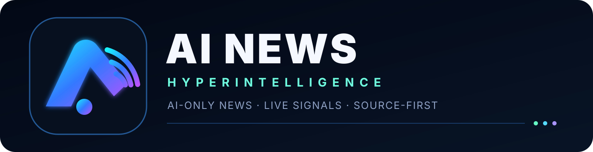
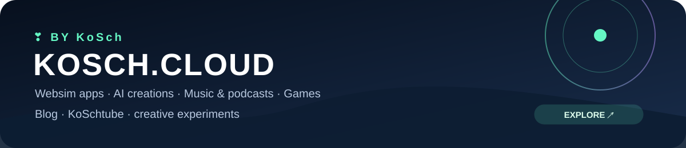

  <a href="PRIVACY.md"><strong>🔐 Datenschutz / Privacy</strong></a> · <a href="PRIVACY-SOURCES.md"><strong>All sources & providers</strong></a> · <a href="https://kosch.cloud"><strong>Impressum / kosch.cloud</strong></a> · <a href="ANDROID-ARCHIVE.md"><strong>APK archive</strong></a>

  

  <strong>AI-only intelligence for models, agents, research, infrastructure, robotics, safety and governance.</strong> 
  Source-first · 160 registered AI sources · 61 provider monitors · refreshed every 30 minutes

  
  

> [!WARNING]
> **BETA / IN DEVELOPMENT.** AI News and the Android APK are active test builds and may contain bugs, incomplete functions, inaccurate classifications, notification issues or breaking changes. **Use at your own risk / Nutzung auf eigene Gefahr.** Do not rely on the app as the sole source for important, legal, safety-critical, financial or operational decisions. Verify important information with the linked original sources. The directly distributed APK is currently a **debug-signed beta build**, not a production Play Store release.

  <a href="https://github.com/chekento/Ainews/releases/download/android-v3.9.0/AI-News-Android-3.9.0.apk"><strong>⬇ CURRENT APK — ANDROID 3.9.0 BETA</strong></a> 
  <a href="https://github.com/chekento/Ainews/releases/tag/android-v3.9.0">Release details</a> ·
  <a href="https://github.com/chekento/Ainews/releases/tag/android-v3.9.0">Stable alias: android-latest</a> ·
  <a href="https://github.com/chekento/Ainews/releases/download/android-v3.9.0/AI-News-Android-3.9.0.apk.sha256">SHA-256 checksum</a> ·
  <a href="PRIVACY.md">Datenschutz · KI · Drittanbieter</a> ·
  <a href="https://kosch.cloud">Impressum / kosch.cloud</a>

  
  
  

  
  

---

<table>
<tr>
<td width="50%" valign="top">

### ◈ LIVE INTELLIGENCE

Strict AI-only relevance filtering across labs, research, independent reporting, governance and safety sources.

**[Open current news →](portal/news.md)**

</td>
<td width="50%" valign="top">

### 📱 ANDROID 3.9.0 BETA

Command Center home, Discover search, multilingual YouTube Video Radar, source controls, saved stories, Smart Watches and nine configurable home-screen widgets.

**3.8.1 startup repair:** Readability recovery, one primary navigation surface, Matrix-safe scrolling, duplicate-WebView boot prevention, an explicit Settings entry and a dedicated Discover surface are included in this repair build.

**3.8.1 UX layer:** Official X/Twitter, LinkedIn, YouTube, Instagram and Facebook provider profiles; local source-first topic views; live news/social radar with adjustable window; Matrix glyph rain; 28 selectable app/widget themes and two Kawaii plush themes.

**3.9.0 Video Radar:** New multilingual YouTube AI News tab with freely selectable languages, system-language default, per-story YouTube discovery for every scanned news item, and dynamic coverage of the full provider registry. Known official YouTube channels are linked directly; providers without a registered channel still receive a provider-specific YouTube discovery search.

**[⬇ Download current APK →](https://github.com/chekento/Ainews/releases/download/android-v3.9.0/AI-News-Android-3.9.0.apk)**

</td>
</tr>
<tr>
<td width="50%" valign="top">

### 🖼️ VISUAL NEWS CARDS

Publisher images are embedded only when explicitly supplied in RSS/Atom metadata. Otherwise the UI uses bundled fallback visuals. No article-page image scraping.

</td>
<td width="50%" valign="top">

### ⌕ POWER SEARCH

Search supports `source:`, `provider:`, `cat:`, `tag:`, `type:`, `after:`, `before:`, `is:saved`, `is:primary`, quoted phrases and negative terms.

**[Provider wire →](portal/llm-wire.md)**

</td>
</tr>
</table>

---

<!-- LATEST_AI_NEWS:START -->
## 🔴 Live AI Intelligence

**160 registered sources · 61 provider monitors · AI-only filter v4 · snapshot 2026-10-04 01:57 UTC**

| # | Source | Desk | Media | AI relevance | Headline |
|---:|---|---|:---:|---|---|
| 01 | **Fireworks AI Blog** | Industry | ◈ | ● HIGH | [- Fireworks AI](https://news.google.com/rss/articles/CBMiS0FVX3lxTE93ek5kR1VZc0V4clZPdm9CeGZONnI4aXlKa2lmZmpZVDM3cktiU2lqM2Uta0dNS1pEMWl5MndnOUY2V0hJN2VUMnZZRQ?oc=5) |
| 02 | **Asbury Park Press · provider monitor** | Industry | ◈ | ● HIGH | [Is Character ai down. Character ai down Saturday night](https://news.google.com/rss/articles/CBMiwgFBVV95cUxNUkgxdVNDb29QVjhaTUhxaEhWaWFmN3pqQm82dGxPdHFndGM4TEllcTVSWnYwQnB3NTdwZTN4dHN3aVY4RTQydGN3dzE5SGxkYVVSZ1hUUkVySm9SRkVWVGp1UEg4TWFWa29Nc2pvLWZpQ2hNVVBTOWVydkYwZnBVelF3bzNpbWxFMUxja0xWcHFtQlpWb2ZTQXRVN2VrM0d6TVJrN3V3T2E2Nm1vb2YxVEY3T2RuTzZ2LXhjbmhBSko0dw?oc=5) |
| 03 | **Reddit · r/MachineLearning** | Research | ◈ | ● HIGH | [Jev: Not Frontier, But Still Worth Your Attention [R]](https://www.reddit.com/r/MachineLearning/comments/1wx1knr/jev_not_frontier_but_still_worth_your_attention_r/) |
| 04 | **Hugging Face Blog** | Open Source | ◈ | ● HIGH | [The Agent Said It Was Done. The Database Disagreed.](https://huggingface.co/blog/microsoft/thinkingbox) |
| 05 | **Cursor Blog** | Industry | ◈ | ● HIGH | [Billing - Cursor - Cursor](https://news.google.com/rss/articles/CBMiTEFVX3lxTE5nV25Pa3V2bElCcXUwYzEwSlpmc0picHR5YlRKM0xoZnNhZXliY19hVWNvVms0X29kLWdSaHJ1YjhTYlZMcHdybXMyUGY?oc=5) |
| 06 | **Cursor Blog** | Industry | ◈ | ● HIGH | [Usage Dashboard - Cursor - Cursor](https://news.google.com/rss/articles/CBMiSkFVX3lxTFA1d2R6RlhlT0NrNmlHMUkwSVltYzVJMm5CUzRPOEZHSGdPbzJxNzFBOWlPZGVaekVvVFBkZ3VVa0pyRmRtWUdKTnlB?oc=5) |
| 07 | **Reddit · r/MachineLearning** | Research | ◈ | ● HIGH | ["Accepted papers must be imported" deadline NeurIPS 2026 [D]](https://www.reddit.com/r/MachineLearning/comments/1wwz403/accepted_papers_must_be_imported_deadline_neurips/) |
| 08 | **Product Wire · Gemini app** | Products & Agents | ◈ | ● HIGH | [Gemini app limiting what models free & AI Plus users can access, AI Pro adding Deep Think](https://news.google.com/rss/articles/CBMibkFVX3lxTE04R1J3UHRCTHp2S0FSeTd6YUllLS1TYVZvMDFSeVZraUFnZDJxdjk5Rm9Pd3o0Zlk3NEp2WkhOSXQ1aTVTdGJRb2NXaktIRlM1YmVqeHprdWVobkpPTXBiVkVzRFloWC1DamlXbmZB?oc=5) |
| 09 | **Luma AI** | Industry | ◈ | ● HIGH | [- platform.lumalabs.ai](https://news.google.com/rss/articles/CBMiQ0FVX3lxTFAzeHBuaGs5ZlpXMjlKUVVUbDBoTlVXb3pFbVpOcEotRDBSU3g3cTUzRlp5RVhNSjhOV3p4RGNlMlN0NEE?oc=5) |
| 10 | **The Decoder** | Safety & Security | 🖼️ | ● HIGH | [Apparently, OpenAI isn't trying to build "magic intelligence in the sky" anymore](https://the-decoder.com/apparently-openai-isnt-trying-to-build-magic-intelligence-in-the-sky-anymore/) |
| 11 | **TechCrunch AI** | Infrastructure | ◈ | ● HIGH | [Amazon responds to data center backlash, says it no longer uses NDAs](https://techcrunch.com/2026/10/03/amazon-responds-to-data-center-backlash-says-it-no-longer-uses-ndas/) |
| 12 | **Reddit · r/MachineLearning** | Industry | ◈ | ● HIGH | [The Principles of Diffusion Models by Lai et al.: thoughts on the monograph [D]](https://www.reddit.com/r/MachineLearning/comments/1wwtpg6/the_principles_of_diffusion_models_by_lai_et_al/) |

[→ Full generated dataset](data/news.json) · [→ Core sources](config/sources.json) · [→ Extended sources](config/sources-extra.json) · [→ Full transparency catalog](PRIVACY-SOURCES.md)

> **Image policy:** publisher artwork is used only when it is explicitly exposed in RSS/Atom metadata. No article-page image scraping. The Android/Web UI falls back to bundled AI News visuals when no feed image is available.

> **Beta data-quality note:** automated relevance, categorization, provider matching and summaries can still be incomplete or wrong. Verify important information with the linked original source.
<!-- LATEST_AI_NEWS:END -->

---

## ▶ Multilingual YouTube AI Video Radar

Android **3.9** adds a dedicated Video tab that connects the existing AI-news intelligence layer with YouTube discovery without requiring a YouTube Data API key.

- **Every scanned AI story is covered:** each news item can generate a YouTube search from the exact headline plus detected provider context.
- **Free multi-language selection:** the device language is only the default; users can enable German, English, French, Spanish, Italian and many other languages at the same time, or add another language code manually.
- **Dynamic provider coverage:** the complete provider registry participates. There is no fixed shortlist of selected AI companies.
- **Official-channel shortcuts:** when an official YouTube profile is known in the social directory, the app links directly to it; otherwise a provider-specific YouTube discovery search remains available.
- **Per-story access:** normal news cards expose a **▶ Video** action so related YouTube coverage is one tap away.
- **Views:** News → Video, provider/channel discovery and a combined radar can be filtered by topic, provider or source.

The app opens YouTube results and original provider channels rather than mirroring or embedding scraped YouTube content. This keeps the feature API-key-free and avoids depending on fragile YouTube page markup.

---

<!-- PRODUCT_WIRE:START -->
## ◈ Product & Service Wire

The product desk monitors usable AI services separately from general model news: Claude Code, Sora, Gemini, NotebookLM, GitHub Copilot, Ollama, LangGraph, Midjourney, ElevenLabs, n8n, Zapier, Websim.ai and many more.

**Tracked:** 264 products · official product pages · original-link news monitoring · no article mirroring.

**[→ Product registry](config/products.json)** · **[→ Android APK archive](ANDROID-ARCHIVE.md)**
<!-- PRODUCT_WIRE:END -->

---

## 🧭 Signal Deck

| Desk | Coverage |
|---|---|
| **Frontier Models** | GPT, Claude, Gemini, Llama, Mistral, DeepSeek, Qwen, Grok, Kimi, GLM and more |
| **Products & Agents** | agentic systems, coding, browser/computer use, MCP, RAG, assistants and automation |
| **Research** | AI2, Stanford HAI, MIT, arXiv, BAIR, Epoch AI, METR and benchmarks |
| **Infrastructure** | NVIDIA, Cerebras, Groq, GPUs, inference, data centers, accelerators and compute |
| **Robotics & Embodied AI** | robot learning, humanoids, physical AI and autonomous systems |
| **Safety & Security** | evaluations, red teaming, misuse, cybersecurity, alignment and AI security institutes |
| **Compliance & Ethics** | EU AI Act, European AI Office, WAICO, NIST, OECD, UNESCO and Council of Europe |

---

<!-- INTELLIGENCE_SUITE:START -->
## ◉ Intelligence Suite 3.9 — Video Radar & Expanded Intelligence · BETA

Android 3.9.0 keeps **Latest · For You · High Signal · Story Clusters · Brief** and the expanded Discover surface, and adds the multilingual YouTube AI Video Radar. Search starts only after an explicit tap.

**Current 3.9.0:** multilingual YouTube AI Video Radar · per-story video discovery for every scanned AI-news item · freely selectable multiple languages · dynamic full-provider coverage · official-channel shortcuts where known · Social Wire with 61 provider ecosystems · 264 tracked products · Governance desk · interactive radar · 28 themes · Smart Briefs · Smart Watches · Widget Studio · 160 AI sources.

This release contains no generative model runtime; news discovery, filtering, clustering, brief overviews, TTS, watchlists and original-source links remain available locally.

> **Development status:** this is an active beta/test build. Bugs, incomplete functions and breaking changes are possible. **Use at your own risk / Nutzung auf eigene Gefahr.**

### [⬇ Download AI News Android 3.9.0 Beta](https://github.com/chekento/Ainews/releases/download/android-v3.9.0/AI-News-Android-3.9.0.apk)
<!-- INTELLIGENCE_SUITE:END -->

---

## ✦ AI News 3.9.0 · Video Radar & UX Command Center

The current beta turns the app into a personal AI intelligence workspace and adds a multilingual AI-video discovery layer:

- **Video Radar:** every scanned news story can launch language-aware YouTube discovery; official provider channels are surfaced when known.
- **Multi-language video discovery:** multiple languages can be enabled simultaneously instead of locking discovery to the device language.
- **Command Center overview:** Signal Atlas and Provider Matrix summarize the live feed before you open a tab.
- **Collapsible controls:** search stays immediately available while filters, categories, provider chips and source controls can be minimized.
- **Complete provider wire:** core + extended registry with provider dossiers, official newsroom links and current coverage.
- **Personal intelligence:** save reusable filters such as `provider:openai cat:Research`, add local RSS/Atom sources and keep an official social-channel directory on the device/browser.
- **Original-source first:** tapping a story opens the linked publication directly; AI News does not copy article pages or social posts.
- **Two native overview widgets:** Signal Stack shows a multi-story overview, while Live AI Radar shows a rolling 72-hour category/provider overview.

All custom filters, sources, profile links and the local personalization data remain local to the current device/browser. Feed access depends on the publisher's RSS/Atom and CORS policy.

---

## 📱 Android 3.9.0 Beta — Multilingual Video Radar & Expanded Intelligence

The APK uses a local mobile interface rather than depending on GitHub Pages. Android 3.9.0 contains no generative model runtime; news, filters, radar, TTS, watchlists and original-source links remain available. It downloads the current AI-only JSON feed directly from this repository and keeps a bundled offline fallback inside the package.

**UX:** horizontal swipe navigation, Command Center home, advanced Discover search, provider/source/category/provenance/time filters, Rich/Compact/Headline card modes, saved stories, native sharing, Governance Radar, Official Social and product monitoring.

**Customization:** Hypercyber/OLED/Light/System themes, multiple accents, UI density, font scale, animation level, summaries, visual previews, default time range, sorting, refresh cadence, primary-source boost, provider monitors and research-paper visibility.

### [⬇ Download current Android 3.9.0 Beta APK](https://github.com/chekento/Ainews/releases/download/android-v3.9.0/AI-News-Android-3.9.0.apk)

> [!CAUTION]
> This direct APK is a **debug-signed development/beta build**. Installation and use are at your own risk. Back up important data and do not treat the app as production-critical software. A Play Store production package should use dedicated release signing and an AAB pipeline.

---

<!-- ANDROID_WIDGETS:START -->
## ⚡ Hypercyber Android Widgets · BETA

Android **3.9** ships nine native home-screen widgets: **Breaking · Primary Signal · LLM Wire · Governance Radar · R&D / Infra · Signal Stack · Neon Matrix · Signal Clock · Live AI Radar**.

Widgets share source exclusions, expose configurable content mode/accent/text scale/density/summary/metadata, support **Next › · Refresh ↻**, and include one-tap **Widget Studio presets** for balanced, minimal, dense and desk-specific setups. Tapping a headline opens the original source directly.

> Widget refresh timing and rendering can vary by Android device, launcher and battery-management policy. This remains beta functionality.

### [⬇ Download AI News Android 3.9.0 Beta](https://github.com/chekento/Ainews/releases/download/android-v3.9.0/AI-News-Android-3.9.0.apk)
<!-- ANDROID_WIDGETS:END -->

---

## 🛰️ Portal

Every page carries the same beta status, current APK link and legal/privacy navigation.

- **[News](portal/news.md)** — current AI stream
- **[LLM Provider Wire](portal/llm-wire.md)** — 61 provider ecosystems
- **[Governance Radar](portal/governance.md)** — policy, standards, ethics and safety
- **[Official Social](portal/social.md)** — official profile links plus public RSS/Atom/Bluesky signals; no private-account scraping
- **[Privacy & all sources](PRIVACY.md)** — data flows, local storage, permissions and source transparency

---

<strong>⚙ Repository / technical details</strong>

### Architecture

- `scripts/fetch-news.mjs` — AI-only aggregation, dedupe, category assignment, source/provider monitors and feed-image extraction
- `scripts/update-readme-news.mjs` — refreshes the live repository frontpage block
- `data/news.json` — generated intelligence dataset
- `config/sources.json` + `config/sources-extra.json` — 160-source matrix
- `config/providers.json` + `config/providers-extra.json` — 61 provider ecosystems
- `android/` — Android beta app, native widgets and local mobile UI
- `assets/branding/` — repository/web logo system
- `.github/workflows/refresh-news.yml` — 30-minute feed refresh
- .github/workflows/android-apk.yml — Android 3.9.0 beta build and stable `android-latest` download

### Android build

Package: `cloud.kosch.ainews`  
Status: **Beta / in development**  
Minimum Android: API 26  
Target / compile SDK: 35  
Java: 21

### Current direct-test release

- APK: `https://github.com/chekento/Ainews/releases/download/android-v3.9.0/AI-News-Android-3.9.0.apk`
- SHA-256: [download checksum](https://github.com/chekento/Ainews/releases/download/android-v3.9.0/AI-News-Android-3.9.0.apk.sha256)
- Release channel: `android-latest`

<strong>AI NEWS // HYPERINTELLIGENCE · BETA</strong> Source first. AI only. Signal over noise. No generative runtime is bundled.

---

   
  <strong>❣️ by KoSch · <a href="https://kosch.cloud">kosch.cloud</a></strong>

